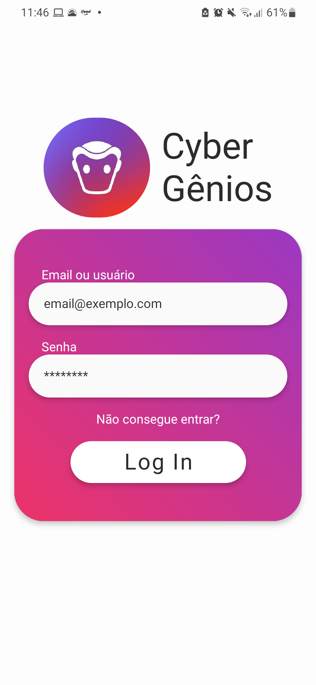
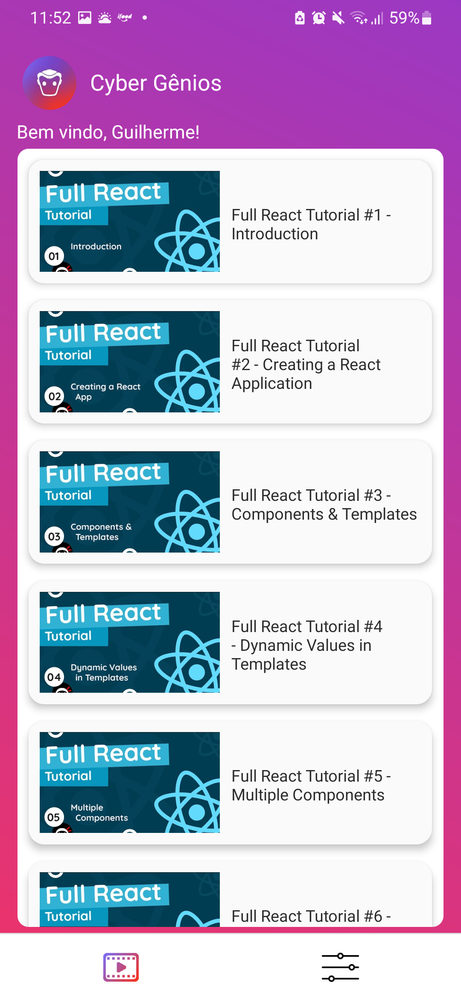
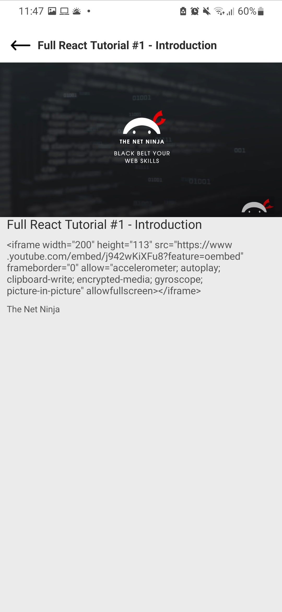
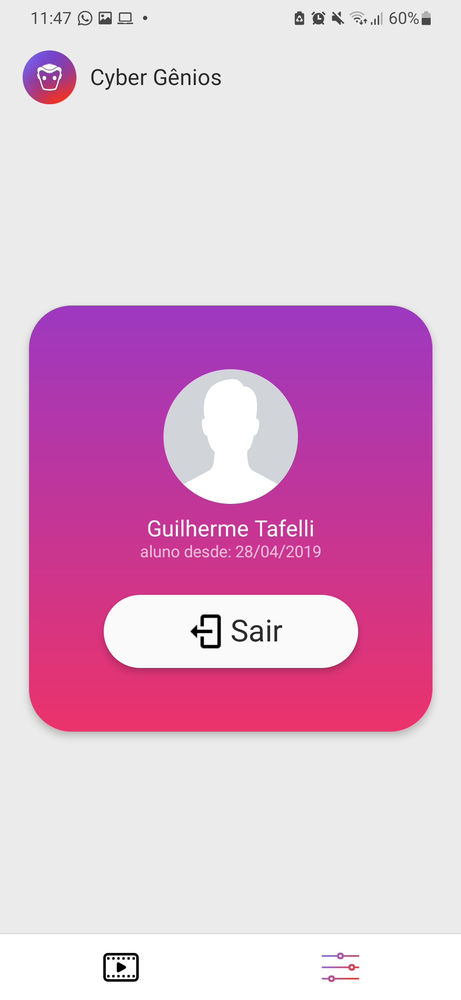

## This app was made as a sample for Guilherme Tafelli for the  role in his company

## Running

* In order to run this project expo and an android or ios emulator (I recommend Android Studio or XCode) are needed.

* **The username is 'guitafelli' and the password is 'testing'**

```
$ git clone https://github.com/marcelofeitoza/CyberGenios

$ cd CyberGenios/ && code .

$ npm install

$ npm install expo-cli    #if needed

$ expo start --android
```

## Preview 


